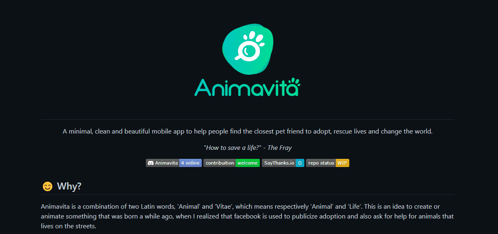

# Projeto com REAME
Um projeto de teste com um arquivo README 😃

## Tecnologias Utilizadas
- HTML
- CSS
- JS 

### Como Utilizar :
1 - Clone o projeto no git 

git clone <url>

2 - Acesse a pasta do projeto 

cd repositorio-com-readme

